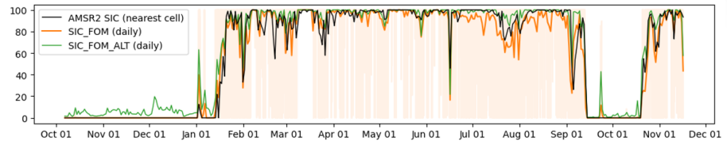
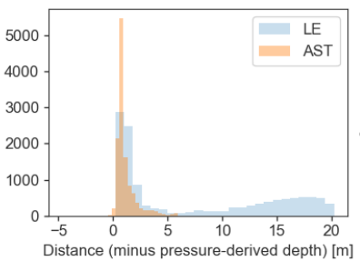

# Processing algorithm

The following describes a typical `kobbe` processing pipeline for ice and ocean data collected using a moored 5-beam Nortek *Signature250* or *Signature500* instruments.

It describes reading Signature files into the `kobbe` environment, appending auxiliary data if available, Sand applying post-processing steps editing the data. Finally, metadata are edited  to conform with scientific formatting standards, and the final dataset is exported as a netCDF file.


```{note}
  Development of `kobbe` has so far focused on sea ice draft. Functionality exists for parsing and processing sea ice and ocean velocity, but this is under development and not well documented below.

  (I.e., steps 11-16 are incomplete..)
```


___

<details>
<summary><b>1. Convert data in <i>SignatureDeployment</i></b></summary>
<p>

Converting from `.ad2cp` file (uploaded from the instrument) to `.mat` file (containing physical variables). The conversion is done in Nortek's *SignatureDeployment* software, outside of the `kobbe` environment.

For long deployments, the export procedure may result in several `.mat`-files per `.ad2cp` file.

</p>
</details>


___

<details>
<summary><b>2. Parse to Python xarray Dataset</b></summary>
<p><br>

- `kobbe.load.matfiles_to_dataset()`
- Loads data from `.mat` files and joins them along a single `Average_TIME` dimension.
- Renames variables and appends relevant metadata.
- Regrids from `Average_TIME` to 2D (`TIME`, `SAMPLE`):

 <a href="../_static/proc_images/kobbe_1d_to_2d.png" target="_blank">
    
  </a>

- Calculates absolute tilt from pitch/roll.
</p>
</details>


___

<details>
<summary><b>3. Estimate sea ice presence from Figure-of-Merit</b> <i>(automatic within #2)</i></summary>
<p>

Currently in `kobbe.load.matfiles_to_dataset()` (calls `kobbe.append._add_SIC_FOM`).

- Use the Figure-of-Merit quality metric from the slanted beams to determine whether there is sea ice
  <a href="../_static/proc_images/FOM.png" target="_blank">
    
  </a>

- FOM is almost completely binary distrubuted. We use a default FOM threshold of 10 000 to classify "good"/"bad".
- Using FOM for all beams to get:
    - `ICE_IN_SAMPLE` (FOM < 10000 for all 4 beams)
    - `ICE_IN_SAMPLE_ANY` (FOM < 10000 for any of the 4 beams)


Calculating a "sea ice concentration" from `ICE_IN_SAMPLE` gives a fairly good match with remote sensing:

<a href="../_static/proc_images/sic_fom_comparison.png"  target="_blank">
    
</a>

Seems to be good agreement with spectra from open water vs ice:

  <a href="../_static/proc_images/SIC_spectra.png" target="_blank">
    
  </a>
</p>
</details>


___

<details>
<summary><b>4. Append external data</b></summary>
<p>

External data (sea level pressure, CTD measurements, magnetic declination) are required for optimal processing (although it is possible to proces data without them). Various functions in `kobbe.append` add external data to the xarray Dataset containing the signature data::


  - `append_ctd()` - CTD data if available
  - `append_atm_pres()` - Append atmospheric pressure from a preexisting dataset
      - `append_atm_pres_auto()` - Append atmospheric pressure by automatically downloading hourly ERA-5 sea level pressure from the nearest grid point and appending it to the dataset
  - `append_magdec()` - Magnetic declination data
      - `append_magdec_auto()` - Automatically obtain magnetic declination from the World Magnetic Model (using the [`geomag`](https://pypi.org/project/pygeomag/) module) and append to the dataset.
  - `append_to_sigdata()` - Other contextual data (remote sensing SIC/SIT, for example)
All external variables are interpolated onto the `TIME` grid. Format and names are standardized for subsequent use in post-processing operations.

</p>
</details>


___
<details>
<summary><b>5. Calculate transducer depth from pressure
</b></summary>
<p>

In order to obtain accurate sea ice draft readings, we need to knwo the depth of the instrument. We calculate this from sea pressure (absolute pressure minus atmospheric pressure) and density using the hydrostatic relation.

- `kobbe.calc.dep_from_p()`
  1. $p_{ABS}$ = `Average_AltimeterPressure` + `conf.PressureOffset`
        - $p_{ABS}$: Total pressure measured at transducer.
  2. $p = p_{ABS} - p_{ATMO}$
        - $p_{ATMO}$: Atmospheric pressure; fixed or from e.g. reanalysis.
  3. $\rho$ calculated from e.g. co-mounted CTD.
        - Automatically if CTD data are appended.
        - A fixed value can be specified if no CTD available.
  4. $g$ calculated as $g(\text{latitude})$ using the `gsw` package.

  5. $\ \ \Large{D = \frac{p}{g \rho}}$
    - $D$ is the (time-varying) depth of the instrument transducer head below the sea surface (meters), calculated using the hydrostatic approximation.


</p>
</details>

___

<details>
<summary><b>6. Calculate initial estimate of sea ice draft
</b></summary>
<p>

The vertical distance between the sea surface and the scattering surface (ocean-ice or ocean-air interfacce), $\eta$, is first calculated without any empirical corrections using the function

- `kobbe.icedraft.calculate_draft()`

The vertical distance between the transducer head and the scattering surface detected by the vertical beam, $S_v$ is taken as `Average_AltimeterDistance` (LE or AST) after applying some corrections:

> $S_v$ =
>`Average_AltimeterDistance`
>$\cdot \cos \theta \cdot c_{S, OBS}$/`Average_Soundspeed`$\cdot \beta_{OW}$


- $S_v$: Vertical distance between transducer and scattering surface:
- $\theta$: Instrument tilt (computed in #2).
- $c_{S, OBS}$: Sound speed calculated from sensor
    - (..if available - otherwise, this term is set to 1).
- `Average_Soundspeed`: Sound speed calculated in the Signature500 onboard algorithm (time varying as a function of measured temperature)
- $\beta_{OW}$: Time-varying, empirically derived "open water correction" coefficient. Set to 1 during the initial estimate.

A quality parameter `Average_AltimeterQualityLE/AST` is associated with each `Average_AltimeterDistance` sample. We apply this automatic quality flag by setting $S_v$ to NaN wherever `Average_AltimeterQualityLE/AST` is below a certain thrreshold (default value 8000).

The vertical position $\eta$ of the scattering surface relative to the sea surface (positive downward) is computed from $S_v$: and depth $D$:

> $\eta = D - S_v - \alpha_{OW}$

Where $\alpha_{OW}$ is an empirically determined fixed offset, initially set to zero.

$\eta$ (stored in the variables `SURFACE_DEPTH_LE/AST`) includes measurements of:

- *In open water*: The position of the water surface (should be close to zero on average, but may vary due to waves).
- *In sea ice*: The sea ice draft (vertical distance between  the water surface and the bottom of the sea ice).

Sea ice draft (variables `SEA_ICE_DRAFT_LE/AST`) is equal to $\eta$, but only includes measurements from samples where ice-presence was detected (using the FOM criterion in all four beams). Sea ice draft from any open-water or mixed measurements is set to NaN.

In addition, any sea ice draft estimates with values < 30 cm are considered erroneous and removed (set to NaN).

Sea ice draft variables (`SEA_ICE_DRAFT_LE/AST`) are computed for each sample and have dimensions (`TIME`, `SAMPLE`). From these, we compute the median of valid sea ice draft estimates per ensemble and assign them to variables `SEA_ICE_DRAFT_MEDIAN_LE/AST` (with dimensions `TIME`).

</p>
</details>

___

<details>
<summary><b>7. Filter LE distances to reject false near-transducer ice keels </b> <i>(automatic within #6)</i></summary>
<p>

In the LE distance data (`Average_AltimeterDistanceLE`), we typically observe a large fraction of measurements that are clearly in the water column between the transducer and the ice or ocean surface, resulting in a broad peak within 0-10 m of the transducer head. This near-transducer peak (referred to here as "false keels") is typically not present in AST distances.

<a href="../_static/proc_images/AST_LE_histograms.png" target="_blank">
    
</a>

We interpret near-transducer values an artifact, i.e. *not* as resulting from very deep ice keels. A likely suspect is the LE algorithm detecting zooplankton or other material in the water column.

We do not want to include such near-transducer "false ice keels" in estimates of sea ice draft. As rough quality control of the LE distances, **we require that the LE distance is within a certain distance (default 0.5 m) of the AST distance.**
This provides an effective filter of false ice keels from the LE dataset.

 - The maximum allowed distance between AST and LE is set
 using the `LE_AST_max_sep` parameter in  `icedraft.calculate_draft()`.

In many instances, this may result in removing quite large parts of the LE distances in the datasets. For example,
in datasets from Sig500s mounted near 20 m depth in the northwestern Barents Sea, this reduces the amount of valid LE measurements by 1/4 to 1/3.


</p>
</details>


___

<details>
<summary><b>8. Calculate empirical open water corrections</b></summary>
<p>

To obtain the final sea ice draft estimates, we make empirical correction to $\eta$. The corrections compensate for

1. Errors in depth as a result of errors in the pressure reading.
    - Sources of error:
      - Accuracy of pressure sensor (0.1% of Signature pressure rating)
      - Possible temperature effects on the piezoelectric pressure sensor in cold waters
      - Errors in density $\rho$ (typically less significant)
    - Pressure errors are largely compensated for by the fixed offset coefficient $\alpha_{OW}$. This coefficient is typically on the order of 10 to 20 cm.
2. Errors in sound speed.

   While the algorithm does compensate for changes in water sound speed, we have (at best) information about the sound speed at a single fixed location. Sound speed may change above the instrument, e.g. as a result of surface heating/cooling/freshening.

   - This error often has a seasonal cycle as the mean sound speed of the above-instrument waters change seasonally.
   - Seasonal sound speed variations are typically compensated for by the time-varying factor coefficient $\beta_{OW}$.


We want to find one or both coefficients $\alpha_{OW}, \beta_{OW}$ to correct the altimeter distance so that the **mean value of open-water measurements is near zero**.

1. The "open water surface depth" $\eta_O$ is found ($\eta_O=D - S_v$ for samples classified as *open water*).
2. A low-passed filtered (default: daily) time series of $\eta_O$ ($\eta_{O, LP}$) is produced by:
    - Filtering out outliers (reject outliers > 15 cm from deployment median)
    - Computing ensemble medians
    - Computing daily means from these, only including days with >2.5% open water ensembles.
    - Linearly interpolate to get a continuous daily time series.
    - (Smoothe with a running mean if we want to use a coarser time scale.)
3. The fixed offset correction $\alpha_{OW}$ is taken as the mean of $\eta_{O, LP}$.
4. The time-varying factor correction $\beta_{OW}$ is calculated so that the low-pass filtered open water surface (after applying $\alpha_{OW}$) is zero:

> $\beta_{OW}(t) = (D_{LP}(t) - \alpha_{OW}) / (D_{LP}(t) - \eta_{O, LP}(t))$

..which is equivalent to the following holding over the LP time scale for open-water samples:

>$\beta_{OW} S_v + \alpha_{OW} \approx D$


</p>
</details>


___

<details>
<summary><b>9. Recalculate sea ice draft, now using open water correction
</b></summary>
<p>

- `kobbe.icedraft.calculate_draft()`
- Recalculate sea ice draft with the same formula as before, but now using the
  empirically derived values for $\alpha_{OW}, \beta_{OW}$:

> $\eta = D -$ `Average_AltimeterDistance`$
\cdot \cos \theta \cdot c_{S, OBS}$/`Average_Soundspeed`$\cdot \beta_{OW}- \alpha_{OW}$

- Again, sea ice draft is taken as equal to $\eta$ when ice is present, and NaN otherwise.
</p>
</details>

___

<details>
<summary><b>10. Calculate ice velocity</b></summary>
<p>

- `kobbe.vel.calculate_ice_vel()`
- Auto editing?
</p>
</details>


___

<details>
<summary><b>11. Calculate ocean velocity</b></summary>
<p>

- `kobbe.vel.calculate_ocean_vel()`
- Auto editing?
</p>
</details>


___


<details>
<summary><b>12. Ocean velocity editing</b></summary>
<p>

- Sidelobe rejection
    - `kobbe.vel.reject_sidelobe`
    - What happens here?
    - *"Rejected samples close enough to the surface to be affected by sidelobe interference"*
- Range masking
    - `kobbe.vel.uvoc_mask_range()`
    - Threshold for various parameters like corr, amp, speed, tilt, amp jumps...

- Clear near-empty bins
    - `kobbe.vel.clear_empty_bins()`
</p>
</details>


___

<details>
<summary><b>13. Magnetic declination correction</b></summary>
<p>

- `kobbe.vel.rotate_vels_magdec()`
- Rotates both ice and ocean velocities

</p>
</details>


___

<details>
<summary><b>14. Interpolate ocean velocity onto fixed depths</b><i> (Optional)</i></summary>
<p>

- `kobbe.vel.interp_oceanvel`

</p>
</details>


___

<details>
<summary><b>15. Format metadata using CF/ACDD conventions*</b></summary>
<p><br>

</p>
</details>

___

<details>
<summary><b>16. Export to netCDF*</b></summary>
<p><br>

</p>
</details>

___
___
___
