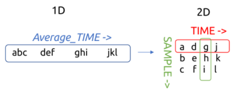
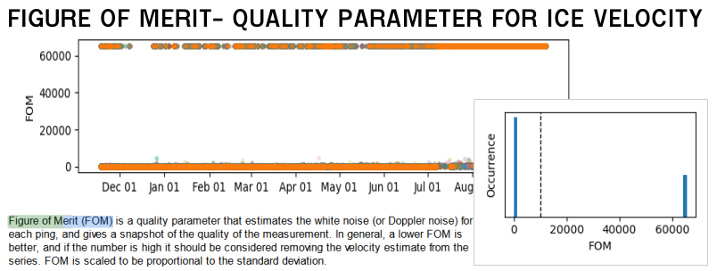
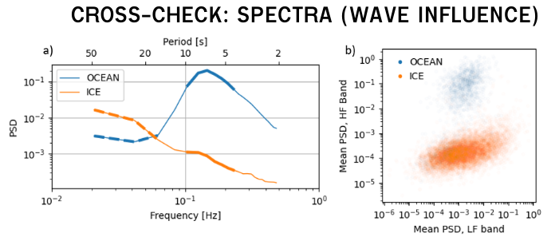

# Processing pipeline

The following describes a typical processing pipeline for ice and ocean data collected using a moored 5-beam Nortek Signature250 or Signature500.

It describes reading Signature files into the `kobbe` environment, appending auxiliary data if available, and applying post-processing steps editing the data. Finally, the metadata is edited to conform with scientific formatting standards, and the final dataset is exported as a netCDF file.

___

<b>1. Convert data in <i>SignatureDeployment</i></b>

Converting from `.ad2cp` file (uploaded from the instrument) to `.mat` file (containing physical variables). The conversion is done in Nortek's *SignatureDeployment* software, outside of the `kobbe` environment.

For long deployments, the export procedure may result in several `.mat`-files per `.ad2cp` file.

___

<b>2. Parse to Python xarray Dataset</b>

 

- `kobbe.load.matfiles_to_dataset()`
- Regrid from `Average_TIME` to 2D (`TIME`, `SAMPLE`):

 

___

<b>3. Estimate sea ice presence from Figure-of-Merit</b> <i>(automatic within #2)</i>

- Currently in `kobbe.load.matfiles_to_dataset()`
    - Calls `kobbe.append._add_SIC_FOM`
    - (Should probably force an explicit call for this?)

  
  

___

<b>3. Filter LE distances to reject false scatterers </b> <i>(automatic within #2)</i>

- Currently in `kobbe.load.matfiles_to_dataset()`
    - Calls `kobbe.append._add_SIC_FOM`
    - (Should probably force an explicit call for this?)

___

<b>4. Append external data</b>

- Various functions in (`kobbe.append`).
- Interpolates onto TIME, grid
    - CTD data if available
    - Atmospheric pressure from reanalysis or similar
    - Magnetic declination data
    - Other contextual data (remote sensing SIC/SIT, for example)

___

<b>5. Calculate transducer depth from pressure
</b>

- `kobbe.calc.dep_from_p()`
  1. $p_{ABS}$ = `Average_AltimeterPressure` + `conf.PressureOffset`
        - $p_{ABS}$: Total pressure measured at transducer.
  2. $p = p_{ABS} - p_{ATMO}$
        - $p_{ATMO}$: Atmospheric pressure; fixed or from e.g. reanalysis.
  3. $\rho$ calculated from e.g. co-mounted CTD.
        - Automatically if CTD data are appended.
        - A fixed value can be specified if no CTD available.
  4. $g$ calculated as $g(\text{latitude})$ using the `gsw` package.

  5. $\ \ \Large{D = \frac{p}{g \rho}}$
    - $D$ is the (time-varying) depth of the instrument transducer head below the sea surface (meters), calculated using the hydrostatic ap

___

<b>6. Calculate initial estimate of sea ice draft
</b>

- `kobbe.icedraft.calculate_draft()`

- Vdist = Vertical distance between transducer and scattering surface:

    Vdist = ALT_DIST * np.cos(theta_tilt) * (ss_obs/ss_nom) * BETA_ow

- Spos = Position of the scattering surface below the water line

    Spos = depth - Vdist

- Sea ice draft SID is equal to Spos where:
    - Naned out in open water
    - Nanes out when SID s less than -0.3 m..
    - Calculating ensembe medians ignoring Nans
    - Naning out ensemble meanswhen SID s less than -0.3 m..

___

<b>7. Get time-varying open water sound speed correction</b>

- `kobbe.icedraft.get_Beta_from_OWSD()`
- USING A LONG-TIME AVERAGE OFFSET..
- SHOULD MAYBE BE fixed offset plus beta??

___

<b>8. Recalculate sea ice draft, now using OW correction
</b>

- `kobbe.icedraft.calculate_draft()`
- FORMULA!
- -> Should be done with ice draft here!

___

<b>9. Calculate ice velocity</b>

- `kobbe.vel.calculate_ice_vel()`
- Auto editing?

___

<b>10. Calculate ocean velocity</b>

- `kobbe.vel.calculate_ocean_vel()`
- Auto editing?

___

<b>11. Ocean velocity editing</b>

- Sidelobe rejection
    - `kobbe.vel.reject_sidelobe`
    - What happens here?
    - *"Rejected samples close enough to the surface to be affected by sidelobe interference"*
- Range masking
    - `kobbe.vel.uvoc_mask_range()`
    - Threshold for various parameters like corr, amp, speed, tilt, amp jumps...

- Clear near-empty bins
    - `kobbe.vel.clear_empty_bins()`

___

<b>12. Magnetic declination correction</b>

- `kobbe.vel.rotate_vels_magdec()`
- Rotates both ice and ocean velocities

___

<b>13. Interpolate ocean velocity onto fixed depths</b><i> (Optional)</i>

- `kobbe.vel.interp_oceanvel`

___

<b>14. Format metadata using CF/ACDD conventions*</b>

 

___

<b>15. Export to netCDF*</b>

 

___
___
___

### Q:

- Where is open water stuff calculated?
- Where is the filtering LE by LE-AST distance?
___

### Q Nortek: